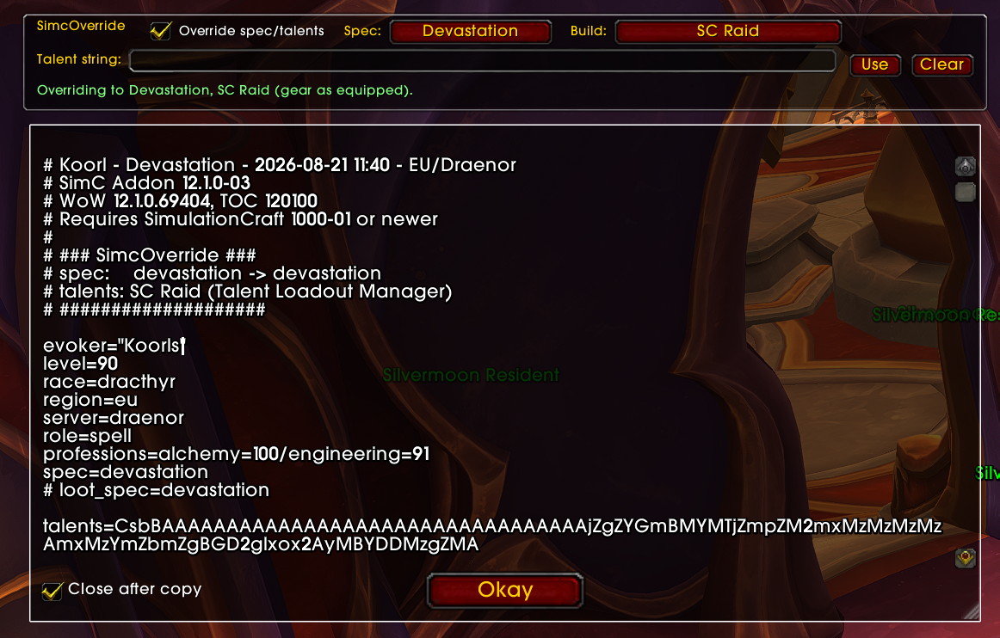
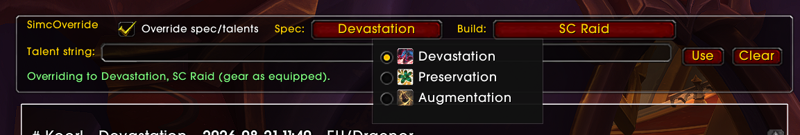
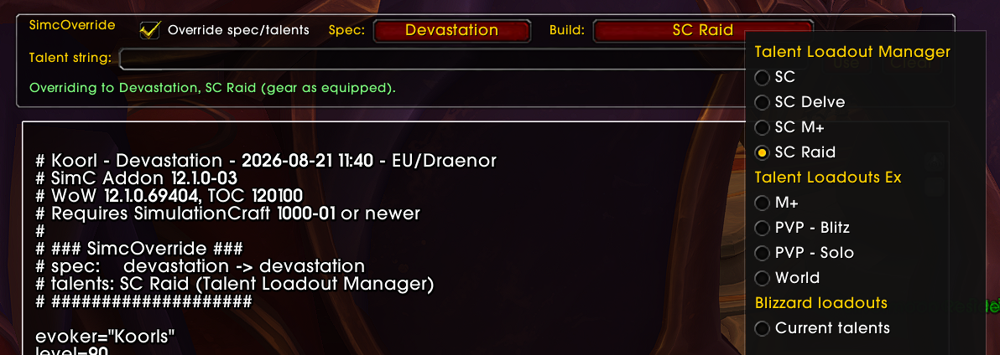

# SimCOverride

Sim a different spec or talent build without respeccing.

Type `/simc` and SimulationCraft exports your character exactly as it is right now, talents
included. That's often not what you want to sim. You're in your M+ build but you want raid
numbers, or you want to see the same gear on two different specs.

SimCOverride adds a small panel to the `/simc` window. Tick Override, pick a spec and a build,
and the export comes out as if you were already in that build. Copy it into Raidbots and you're
done. Your character isn't touched, and neither is your gear.

## Requirements

- [Simulationcraft Addon](https://github.com/simulationcraft/simc-addon)

## Usage

Type `/simc` to open the Simulationcraft window. Override settings will appear at the top.

**Spec Override**: Change the spec shown in the SimC profile to any spec for your class.

**Talent Override**: Select from saved loadouts (added by TalentLoadoutManager or similar addons) or paste a custom talent string.

## Picking a build

The build list fills itself from whatever you have installed. Talent Loadout Manager gives you
its own loadouts plus the Blizzard ones, for any spec. Talent Loadouts Ex does the same.
Blizzard's own loadouts are there too, including ones remembered from the last time you were in
that spec.

The same build showing up in two addons only appears once in the list.

No loadout addon? Doesn't matter. Paste a talent string from Wowhead, Archon, Icy Veins or
anywhere else into the Talent string box and it works out the spec by itself.

## What it won't do

SimCOverride never re-picks gear for the spec you chose. You get your current gear, on a
different build.

The `# Saved Loadout:` lines in the export still name the spec you're physically in. They're
just comments, Raidbots ignores them, and a banner at the top tells you which build was actually
used.

A couple of specs come out with the wrong `role=` line: Restoration Druid and Augmentation
Evoker both say `role=attack`. That's a bug in SimulationCraft itself, and SimCOverride copies it
on purpose so the profile looks identical to one SimC made. It doesn't affect your sim.

Other addons that ask SimulationCraft for your profile directly get the untouched version. The
`/simc` window, the minimap button and the addon compartment button all use the override.

## Other addons

Talent Loadout Manager and Talent Loadouts Ex both append their loadout lists to the end of the
export. SimCOverride runs before they do, so everything stacks up fine and you don't need to
disable anything.
